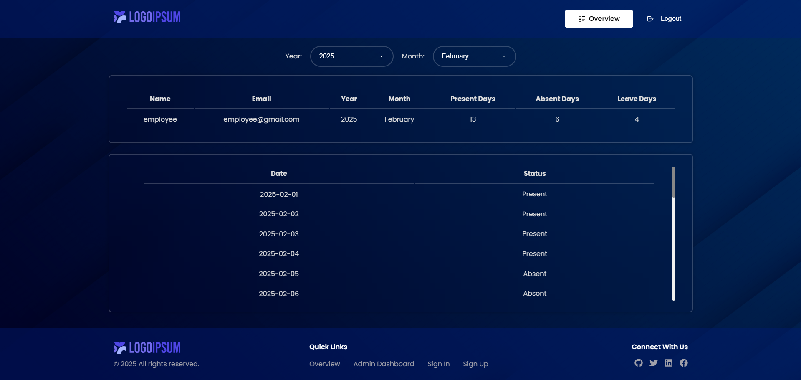

<!-- <div align="center">
  <br />
    <a href="#" target="_blank">
      
    </a>
  <br />

  <br />
  <div>
    
    
    
    
    
    
    
    
  </div> -->

  <h1 align="center">Employee Attendance System - MERN</h1>

   <div align="center">
     The Employee Attendance System is a web-based solution designed to track employee attendance and work hours efficiently. Built using React.js, HTML, CSS, and JavaScript for the frontend and powered by Node.js for the backend, it ensures seamless performance and scalability. The system supports MongoDB for secure and reliable data storage. Key features include user authentication and role management, employee check-in and check-out, automated work hour calculation, real-time attendance tracking, and comprehensive reporting with data visualization. 
    </div>
</div>

## <a name="introduction">TATS :- Introduction</a>

The Employee Attendance System is built with React.js, Node.js, and MongoDB to track attendance efficiently. Key features include user authentication, role management, check-in/out, automated work hour calculation, real-time tracking, and detailed reports, ensuring seamless workforce management and reducing manual workload.

## <a name="tech-stack">TATS :- Tech Stack</a>

- React JS
- JavaScript
- HTML5
- CSS3
- Node JS
- Express JS
- Nodemon
- MongoDB

## <a name="features">TATS :- Features</a>

### Admin Features:

👉 Add, Edit, and Delete Employee Attendance

👉 View All Attendance Records for a Selected User

👉 Monthly Attendance Summary with Present, Absent, and Leave Days

👉 User Management (Add, View, and Update User Details)

👉 Secure Admin Access with Role-Based Authorization

### Employee Features:

👉 View Own Attendance Records

👉 Attendance Summary by Month and Year

### General Features:

👉 User Authentication (Login, Registration)

👉 Protected Routes using JWT Tokens

👉 Responsive UI for Desktop and Mobile Devices


## <a name="quick-start">TATS :- Quick Start</a>

**Setup Backend**

```bash
cd backend
npx nodemon server.js
```

**Setup Frontend**

```bash
cd frontend
npm start
```

Open [http://localhost:3000](http://localhost:3000) in your browser to view the project.

## <a name="usage">🚀 Usage</a>

### Admin Login

- Use the login credentials of an Admin user.
- Access the Admin Dashboard to manage attendance.

### Employee Login

- Use employee login credentials.
- View personal attendance records.

### Admin Dashboard

- Select a user and view all attendance records.
- Add, Edit, or Delete attendance day by day.
- View monthly summaries for Present, Absent, and Leave days.
